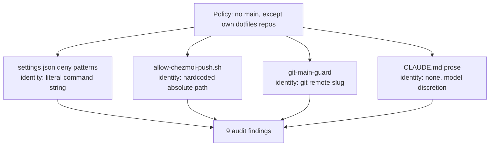

# Mega-container and main-branch guards: remediation queue

## Summary

Rebuild the mega-container's correctness guarantees and the main-branch guard system as a
sequenced queue of independently shippable fixes, ordered by evidenced pain, where each fix
ships only once an executable assertion proves it done and catches it regressing. Branch policy
collapses to one definition enforced by git hooks. Adopt `omp` (oh-my-pi) alongside the existing
`omo` harness, with patch-carrying forks of both under our own control.

---

## Problem Frame

Two classes of failure dominate the last six months of this environment, and neither is
untidiness.

**Fixes do not stick.** The agent-model misconfiguration bug was reported across at least three
sessions and chased across four commits (`4a2e090`, `24193e1`, `f6f1704`, `2f07e7c`) in five
days. Each fix shipped and the next gap was found by hand. The final commit in that chain
reveals why: `mega-doctor` *did* assert that agents resolve to `claude-opus-5-fast`, but it was
reading `oh-my-openagent.json` — a file that had been deleted. The assertion had been dead for
an unknown period while continuing to report success. It also warns rather than fails.

An assertion that can silently stop asserting is worse than no assertion, because it converts
"unverified" into "verified" without anyone noticing.

The same shape recurs outside the assertion layer. The cheatsheet LaunchAgent hid the one command
that failed behind `2>/dev/null` and crash-looped roughly ten thousand times over eight weeks
against a zero-byte log. The Proof watchdog runs every minute and sends its start attempt to
`/dev/null`, so a missing checkout failed silently and indefinitely. Neither needed better logic;
both needed to stop discarding their own error output.

**The same policy is defined four times, four different ways.** The rule "don't touch main,
except in my own dotfiles repos" is expressed in `private_dot_claude/modify_settings.json`
permission patterns, in `private_dot_claude/hooks/executable_allow-chezmoi-push.sh.tmpl`, in
`private_dot_local/bin/executable_git-main-guard`, and in prose in
`private_dot_claude/CLAUDE.md.tmpl`. Each layer answers "which repo is this?" differently — one
by hardcoded absolute path, one by git remote slug, one by literal command-string prefix, one
not at all. An adversarial audit produced nine findings, four of them high severity. That count
is a property of the duplication, not of any individual script.

The cost lands both ways. Pushes to `glove80` main are blocked with no override anywhere, so
they get done by hand. Meanwhile a push to an unrelated repo's main can be authorized by the
dotfiles exception, and agents running inside the container are covered by no guard at all.

---

## Key Decisions

**Assertion-first, with collapse where assertions are awkward.** Work is ordered by evidenced
pain, but no item is complete until an executable assertion covers it. Where an invariant is
hard to assert because it has several competing definitions, that difficulty is the signal to
collapse the definitions first. The guard system fails this test immediately, which is why it
carries nine findings.

**Failure output is never discarded.** Three separate outages traced to a process hiding its own
error: a check reading a deleted file, a login agent redirecting stderr away, and a watchdog
discarding its start attempt. Silencing output is what turned each from a visible fault into an
invisible one.

**Assertions fail closed and prove themselves live.** The `2f07e7c` failure mode — a check
reading a deleted file and passing — is the specific defect the harness exists to prevent. A
check whose input is missing reports failure. Checks block rather than warn.

**Git hooks enforce branch policy, reading one policy file.** Git hooks are the only layer every
actor shares: Claude Code on the host, `omo` and `omp` in the container, and a plain shell. They
also fire on the git operation itself, so enforcement no longer depends on pattern-matching
command surface forms — the class that produced most of the audit's false negatives.

**`--no-verify` is the only escape hatch.** Standard git, nothing to build, and it must be typed
deliberately. The risk is that it becomes a default path rather than an exception, so its
distribution is itself asserted against.

**Chezmoi is the single delivery mechanism; no symlinks.** Symlink delivery was evaluated and
rejected. Thirty-seven of forty-six files under `private_dot_claude/` are templated and cannot
be symlinked at all, leaving too narrow a surface to justify a second mechanism. The problem
symlinks would have solved — a tool rewriting applied config where the source never learns — is
solved instead by asserting that applied config matches source.

**1Password remains the secrets mechanism.** The boot fragility is therefore hardened inside
1Password rather than designed away by moving to encrypted-at-rest secrets.

**`omp` joins `omo` rather than replacing it.** This mirrors how sjawhar actually runs them: his
`mise.toml` pins both `github:sjawhar/oh-my-pi` and `github:sjawhar/oh-my-opencode`.

**Forks carry our own patches.** Pinning alone was rejected in favour of the ability to ship
fixes upstream will not take. The merge, build, and release maintenance is accepted as a
standing cost.

**Pane splits subdivide the focused pane by default.** Both split bindings in
`dot_tmux.conf` carry tmux's `-f` flag, which spans the full window and makes a grid layout
unreachable. Grid splits move onto the keys already in use; full-span splits move one row up
under the same fingers, so both behaviours stay available.

**Tailscale already provides container access; `forward` is rejected.** Tailscale runs inside
the mega container rather than as a sidecar, so the container is its own tailnet node and any
service bound to `0.0.0.0` is directly reachable. Manual SSH forwarding has only been necessary
for services bound to loopback. `sjawhar/forward` does not do general TCP forwarding, and its
Linux-only process hardening and systemd assumptions do not port to a Docker container with a
macOS client.

**Agents publish their working directory rather than changing the shell's.** A child process
cannot change its parent shell's directory, so the pane's own cwd goes stale during an agent
session and path-copying reports the wrong location. Agents instead write their working
directory to a pane-scoped tmux option, which every harness can do with a shell one-liner and
which falls back to the shell's cwd when unset.

**Session listing builds on the existing sqlite queries.** OpenCode stores all sessions in one
database and its CLI filters by a project derived from cwd with no override. The existing
`oc history` wrapper already queries that database unfiltered, so a cross-project view is an
extension of local tooling rather than a change to the upstream CLI.

**sjawhar's setup is a source of candidates, not a template.** Each borrowed pattern enters the
queue as its own gated item.

---

## Requirements

**Verification harness**

- R1. Every invariant that has previously regressed has an executable assertion.
- R2. An assertion whose input file, key, or command is missing reports failure. Absence is
  never treated as success.
- R3. Assertions block rather than warn: a failing assertion means the environment is not ready.
- R4. The suite runs on rebuild and on demand, and reports which assertions ran, not only which
  passed.
- R5. Each queue item is defined as "make assertion N pass" and is not complete until it does.
- R6. Divergence between applied configuration and its chezmoi source is asserted against.
- R7. A supervised or scheduled process that fails writes the reason to its log rather than
  discarding it.

**Main-branch guard**

- R8. Branch policy has exactly one definition, and git hooks are the enforcement layer.
- R9. Repo identity is determined by git remote slug everywhere, never by filesystem path.
- R10. Authorization is evaluated against the repo the git operation targets, not the ambient
  session directory.
- R11. Enforcement does not depend on matching command surface forms.
- R12. The exception list covers both `QuantumLove/dotfiles` and `QuantumLove/glove80`, and
  applies uniformly to edit, checkout, commit, and push.
- R13. Commit on a protected branch is mechanically enforced rather than left to prose.
- R14. The guard remains active when HEAD is detached.
- R15. The protected branch is derived from the repo's actual default branch rather than a
  hardcoded `main`/`master` list.
- R16. Enforcement applies to agents running inside the container, not only Claude Code on the
  host.
- R17. `--no-verify` is the only bypass, and no agent configuration, skill, or command template
  distributes it.
- R18. `glove80` is checked out locally so its guard path is exercised.

**Container boot**

- R19. Secrets are classified as required or optional, and a missing optional secret does not
  block boot.
- R20. Plugin installation has a single implementation.

**Agent harness**

- R21. `omp` is installed, configured, and usable in the container alongside `omo`.
- R22. Forks of `oh-my-pi` and `oh-my-opencode` exist under our control, pinned to our own
  releases.
- R23. Model selection for every agent in every harness is declared in committed configuration.
- R24. Declared model selection and fork version resolution are both covered by assertions.

**Terminal and remote access**

- R25. Pane splits subdivide the focused pane by default, with full-span splits bound
  separately.
- R26. tmux bindings and the Glove80 `tmux` layer change together, because a layer key emitting
  an unbound symbol fails silently.

- R27. A single helper exposes a container port to the tailnet, covering both loopback-bound
  services and those already on `0.0.0.0`, and reports the reachable URL.

- R28. Copying the current path yields the agent's working directory while an agent is running,
  and the shell's directory otherwise.
- R29. The `oc` wrapper's session-listing command works, rather than passing an invocation that
  upstream never defined.
- R30. A session view lists sessions across all projects, grouped by project.
- R31. `omp` has a working-directory redirect equivalent to OpenCode's.

**Process**

- R32. Queue items are independently shippable and individually approved before work starts.

---

## Acceptance Examples

- AE1. **Covers R2.** Given an assertion that reads a model name from a config file, when that
  file is renamed or deleted, then the assertion fails rather than passing.
- AE2. **Covers R7.** Given a supervised process that fails to start, when its log is read, then
  the reason for the failure is present.
- AE3. **Covers R6.** Given a tool rewrites an applied config file, when the suite runs, then
  the divergence from chezmoi source is reported.
- AE4. **Covers R10.** Given the ambient session directory is the chezmoi checkout, when a push
  to a protected branch is issued against a different repository, then it is denied.
- AE5. **Covers R9, R12.** Given the `glove80` repo checked out at any path, when a push to its
  default branch is issued, then it is allowed.
- AE6. **Covers R9.** Given the chezmoi repo re-cloned to a path other than
  `~/.local/share/chezmoi`, when a push to `main` is issued, then it is still allowed.
- AE7. **Covers R11.** Given a push expressed as `git push`, `git push origin HEAD`, or
  `git -C <path> push`, when the target is a protected branch in a non-excepted repo, then each
  form is denied.
- AE8. **Covers R14.** Given the primary worktree has a detached HEAD, when a branch operation
  is issued, then the guard evaluates it rather than standing down.
- AE9. **Covers R15.** Given a repo whose default branch is neither `main` nor `master`, when a
  commit is issued on that branch, then the guard applies.
- AE10. **Covers R16.** Given an agent session running inside the container, when it attempts a
  commit or push to a protected branch, then the same policy applies as on the host.
- AE11. **Covers R17.** Given any agent configuration, skill, or command template, when the
  suite runs, then any occurrence of `--no-verify` is reported.
- AE12. **Covers R25.** Given a window already split into two panes, when a split is issued
  from the focused pane, then the new pane subdivides that pane rather than spanning the window.
- AE13. **Covers R26.** Given the Glove80 `tmux` layer, when any key on it is pressed, then the
  symbol it emits is bound in `dot_tmux.conf`.
- AE14. **Covers R27.** Given a service bound only to loopback inside the container, when the
  helper is invoked for its port, then a URL reachable from the Mac is returned.
- AE15. **Covers R28.** Given an agent that has moved to a subdirectory, when the path-copy
  binding is pressed, then the agent's directory is copied rather than the shell's.
- AE16. **Covers R28.** Given no agent is running in a pane, when the path-copy binding is
  pressed, then the shell's directory is copied.
- AE17. **Covers R30.** Given sessions created in several different project directories, when
  the session view is opened from any directory, then all of them are listed.
- AE18. **Covers R19.** Given one optional secret is absent from 1Password, when the container
  boots, then boot completes and the absence is reported.

---

## Scope Boundaries

- OrbStack instability. Four separate occurrences in one observed week make it the single most
  frequent interruption, but it is a host-side virtualization fault that nothing in this queue
  addresses. Handled separately.
- Replacing 1Password with sops+age or any encrypted-at-rest scheme.
- Migrating off `omo`.
- Symlink-based config delivery in any form.
- Adopting `sjawhar/forward`, and SSH-based port forwarding as the primary access mechanism.
- Making a tmux pane's shell follow the agent's working directory.
- Patching upstream OpenCode's CLI to expose its unused global session listing.
- GitHub server-side branch protection as an enforcement layer.
- Adopting `jj`, YubiKey-backed secrets, or a `knives`-style fleet tracker. Noted from the
  comparison, not queued.

---

## Dependencies / Assumptions

- Frequency figures come from roughly six days of surviving local session history
  (2026-08-24 to 2026-08-29), cross-checked against six months of git history. They are lower
  bounds.
- Claude Code permission patterns such as `Bash(git push origin main*)` are assumed to be
  literal prefix matches, which is why forms like `git push origin HEAD` evade them today. This
  could not be verified against local documentation. Moving enforcement to git hooks removes the
  dependency on this assumption.
- Neither `QuantumLove/dotfiles` nor `QuantumLove/glove80` has GitHub branch protection on
  `main`, so no server-side layer backstops the local guards.
- Git hooks are bypassable with `--no-verify` by design. Enforcement assumes a cooperative
  actor and is not a security boundary.
- The Glove80 `tmux` layer currently emits `LS(BSLH)` and `LS(MINUS)`; changing split behaviour
  requires edits in the `QuantumLove/glove80` repo and a keymap regeneration, so R18 (clone
  glove80 locally) is a prerequisite for R25 rather than an independent item.
- Fork maintenance depends on upstream release cadence for `can1357/oh-my-pi` and
  `code-yeongyu/oh-my-openagent`.

---

## Outstanding Questions

**Deferred to planning**

- Where the single branch-policy definition lives and in what format.
- Whether the assertion harness extends `private_dot_local/bin/executable_mega-doctor` or sits
  beside it.
- Whether the existing Claude Code settings and hook layer is retained for fast feedback or
  removed once git hooks cover the same policy.
- How global git hooks are installed and kept live across host and container.
- Fork release and build mechanics.

---

## Sources / Research

**Guard system** — `private_dot_claude/modify_settings.json`,
`private_dot_claude/hooks/executable_allow-chezmoi-push.sh.tmpl`,
`private_dot_claude/hooks/executable_guard-no-main-checkout.sh.tmpl`,
`private_dot_claude/hooks/executable_guard-no-main-edits.sh.tmpl`,
`private_dot_local/bin/executable_git-main-guard`, `private_dot_claude/CLAUDE.md.tmpl`.

**Container** — `mega-container/entrypoint.sh` (1Password fetch sequence),
`private_dot_local/bin/executable_mega-doctor`,
`private_dot_claude/run_onchange_after_install-plugins.sh.tmpl` and
`private_dot_claude/commands/hot-patch.md.tmpl` (duplicate plugin-install loops),
`dot_omo/omo.jsonc`.

**Terminal** — `dot_tmux.conf` (split bindings carrying `-f`). `QuantumLove/glove80`:
`config/glove80.keymap`, `docs/keymap.yaml`, `bin/draw-keymap.sh`.

**Remote access** — `mega-container/docker-compose.yml` (Tailscale runs in-container:
`NET_ADMIN`, `/dev/net/tun`, `TS_STATE_DIR`, `hostname: raf-dev`; healthcheck shows opencode web
bound to `127.0.0.1:4096`). `sjawhar/forward` upstream.

**Sessions and agent tooling** — `dot_bash_functions` (the `oc` wrapper and `oc history`),
`private_dot_local/bin/executable_opencode-prune`,
`private_dot_config/opencode/plugins/opencode-dir/`, `dot_tmux.conf` (path-copy binding).
Upstream `sst/opencode` `src/cli/cmd/session.ts` (`session list` is singular and
project-filtered; `listGlobal` exists but is unwired). `can1357/oh-my-pi` extension docs, with
`sjawhar/dotfiles:omp/extensions/session-env.ts` as a shape reference.

**Comparison** — `sjawhar/dotfiles` (`mise.toml` pinning both agent forks with a 14-day
supply-chain soak window; `installers/omp.sh`; a stated rule that no committed file may contain
an absolute path). `can1357/oh-my-pi` upstream. `code-yeongyu/oh-my-openagent` upstream.
