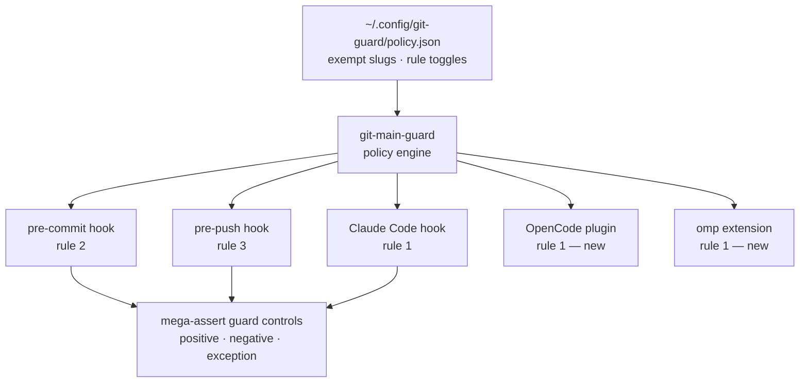
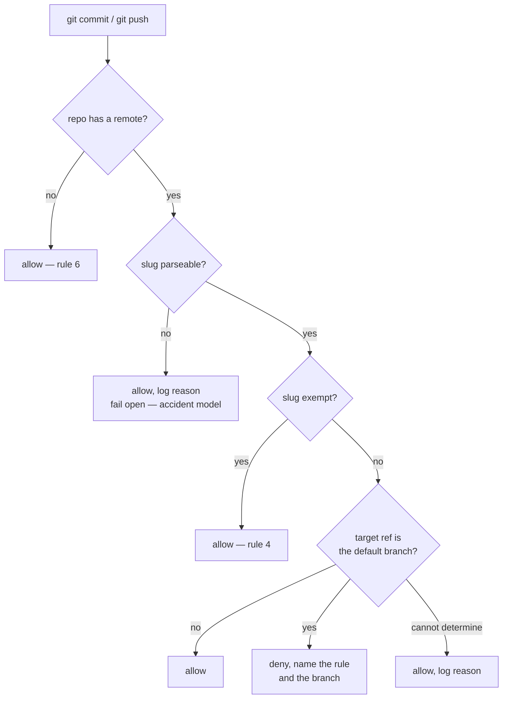
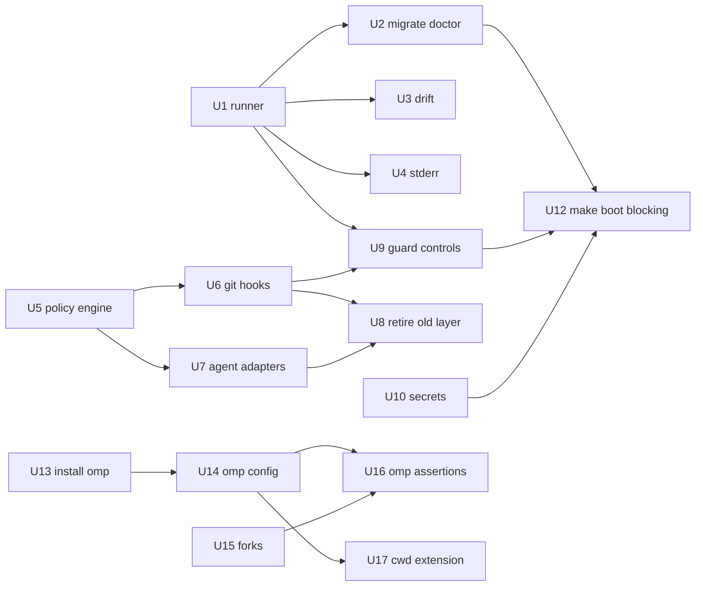

# feat: Mega-container assertion harness and main-branch guard collapse

## Summary

Build an assertion runner with named, self-testing checks, then work through a phased
remediation queue where each item completes by making a named assertion pass. Collapse the
four-layer main-branch guard into one policy file enforced by git hooks for commit and push, and
by three agent adapters for the worktree rule. Adopt `omp` alongside `omo`, and close the
terminal and session items.

---

## Problem Frame

The origin document's diagnosis holds: fixes do not stick because assertions can silently stop
asserting, and one policy is defined four times with four different notions of repo identity.
Research since then sharpened both halves and changed several items.

**The assertion layer is worse than the origin assumed — but not in the way the origin said.**
The origin framed `2f07e7c` as a check that read a deleted file and silently reported success. The
commit body says otherwise: the stale check "reported a hard failure on every run", and the model
assertion "could never have passed either". It failed loudly and nobody consumed the result,
because `entrypoint.sh:399` runs `mega-doctor --quick || echo`. The evidenced remedy for that
specific failure is U12, not the self-test rule.

Silent-pass is still real, just elsewhere: the cheatsheet LaunchAgent and the Proof watchdog both
discarded their failure output, and one live defect in `mega-doctor` does convert an unparseable
input into a pass. `private_dot_local/bin/executable_mega-doctor:81` ends `2>/dev/null || echo 0`, so an
unparseable `omo.jsonc` yields zero strays and prints a pass. Line 74 uses a substring match, so
`claude-opus-5-fast-nano` would satisfy the check. A missing key warns rather than fails. There is
also a third surface with the same shape at
`.chezmoiscripts/run_onchange_after_validate-claude-config.sh.tmpl:80`, and `mega-doctor` hides
roughly forty checks behind an `IN_CONTAINER` gate while still reporting "N passed".

`mega-doctor` cannot host the fix. Its checks are anonymous one-liners with no identity, so
"report which assertions ran" has nothing to address, and "make assertion N pass" has no N.

**The guard rules simplified once stated plainly.** Force-push protection turned out to be
unwanted: the existing unconditional deny at `private_dot_claude/modify_settings.json:141-142`
only ever bound agents, never the user, and force-push to a protected branch is already covered by
denying all pushes there. Removing it also removes the hardest technical problem in the guard
work, since `pre-push` receives no signal distinguishing a force-push from a fast-forward.

**The threat model is accident prevention, not a security boundary.** Agents make mistakes when
they do not know a rule; they comply when a hook and a written rule both exist. This decides
several open questions in favour of low friction: the guard fails open when it cannot identify a
repo, and `--no-verify` stays available.

---

## The rules

The policy in plain language. Everything in Phase 2 exists to enforce exactly this.

1. The primary worktree stays on the default branch, and tracked files there are not edited. Feature
   work happens in `.worktrees/`. Untracked and gitignored files are unaffected.
2. No commit on the default branch.
3. No push to the default branch.
4. `QuantumLove/dotfiles` and `QuantumLove/glove80` are exempt from all of the above.
5. `--no-verify` is the escape hatch.
6. A repo with no remote is unguarded.
7. There is no force-push rule.

Rules 2 and 3 are git hooks and therefore cover every actor at once. Rule 1 has no git hook and
needs one adapter per agent surface.

---

## High-Level Technical Design

### One definition, five enforcement points

Every enforcement point resolves repo identity the same way, by remote slug, because they all call
the same engine. The three agent adapters are thin: they translate their host's payload shape and
delegate, mirroring how `guard-no-main-edits.sh.tmpl` already delegates today.

### Guard decision flow, commit and push

For push the target ref comes from the hook's stdin `remote_ref`, which is authoritative — it
correctly denies `git push origin feat:main`. Identity resolves from the remote actually being
pushed to (hook `$1`), not from a hardcoded `origin`.

### Assertion result model

The runner's contract is what makes R2 and R4 real. Four outcomes, not two.

| Outcome | Meaning | Counts toward failure |
|---|---|---|
| `pass` | Check ran, invariant holds | no |
| `fail` | Check ran, invariant violated | yes |
| `skip` | Not applicable here, with a required reason string | no, but reported |
| `error` | Check could not evaluate — missing input, parse failure, exception | **yes** |

`error` existing as a distinct outcome is the fix for `2f07e7c`: absence of an answer can never
land in the pass bucket. A skip without a reason is an `error`.

### Phase and unit dependencies

Phases 3, 4, and 5 are independent of each other and of Phase 2. Only U12 needs a broad
prerequisite set, which is why it sits last.

---

## Key Technical Decisions

**A new runner, with `mega-doctor` as a thin caller.** `mega-doctor` has no check identity and
cannot acquire one without rewriting its body. But `mega-container/entrypoint.sh:399` depends on
its name, its `--quick` flag, and its exit contract, and `mega-container/executable_rebuild.sh:104`
depends on the bare name and the exit contract. Keeping the name as a wrapper preserves those
callers while the checks move.

**Checks live in `tests/` and are delivered nowhere.** `.chezmoiignore:6-7` excludes `tests` and
`docs`, so nothing there reaches `$HOME` — but `mega-container/docker-compose.yml:35` bind-mounts
the chezmoi source read-only into the container, so `tests/` is readable in both places. The
runner binary is delivered to `~/.local/bin`; the checks it runs are read from the source tree.
This also inherits the existing conventions in `tests/`, which already number assertions against
acceptance examples and render templates hermetically rather than reading applied output.

**Every check declares a self-test.** A check must state a perturbation of its own input that
makes it fail, and the runner exercises it. Without this, R2 is an intention with nothing enforcing
it — which is exactly how `2f07e7c` survived.

**Checks that scan a set declare a minimum cardinality.** A grep across zero files and a grep
across thirty-seven both exit clean today. Declaring `min` turns a broken glob into a failure.

**Invariant checks block; liveness checks warn.** R3 and R19 contradict each other as written: R3
says every failing assertion means the environment is not ready, R19 says a missing optional secret
must not block boot. The split resolves it — "config declares X and X is true" always blocks, "a
network service responds right now" warns and is counted separately. The `2f07e7c` failure was an
invariant that warned, so this rule fixes the real defect without bricking the container on a
transient MCP hiccup.

**The guard fails open when it cannot identify a repo.** Given accident prevention rather than
security, a guard that blocks on ambiguity teaches agents to reach for `--no-verify`, which
disables it everywhere. Unparseable identity and underivable default branch both allow, and log
why. A missing or unreadable policy file is different: that is an `error`, and the assertion suite
catches it.

**Default branch comes from `origin/HEAD` for the remote being pushed to, with no network call.**
A `git ls-remote` in `pre-commit` would make every commit fail offline. `origin/HEAD` is stale
after an upstream rename and `git fetch` never refreshes it, so a separate low-frequency check runs
`git remote set-head -a` across known repos and reports drift. Staleness becomes monitored rather
than silent.

**The hook chains to any repo-local hook it replaces.** A global `core.hooksPath` replaces every
repo's `.git/hooks` entirely, so a work repo using husky or `pre-commit` would lose them silently.
The guard hook execs the repo's own hook after its check. This is cheap and prevents a failure
whose symptom appears in CI rather than locally.

**Rule 1 needs three adapters because git has no pre-checkout or pre-edit hook.** `post-checkout`
fires after HEAD has moved. The Claude Code adapter exists; the OpenCode and omp ones do not, and
`git-main-guard`'s header comment already claims a shared bridge that was never built.

**Force-push handling is deleted, not redesigned.** Removing the rule removes the requirement to
detect something `pre-push` cannot see.

**`omp`'s config file is a live write target.** `omp config set`, `/settings`, and `/model` all
write to `~/.omp/agent/config.yml`, and the docs describe no read-only mode. Rather than fight it,
this is the first real subject for the drift assertion: chezmoi owns the file, and the check
reports when omp has rewritten it.

**`omp` discovery providers are disabled by default.** omp auto-imports MCP servers from
`~/.config/opencode/opencode.json`, slash commands from `~/.claude/commands/**`, and custom tools
from `~/.claude/tools`. Silent inheritance across three harnesses is the same action-at-a-distance
this plan is removing elsewhere. Config is carried over explicitly instead.

---

## Requirements

Origin R-IDs are carried verbatim for traceability. Five changed during planning and are marked.

**Verification harness**

- R1. Every invariant that has previously regressed has an executable assertion.
- R2. A check that cannot evaluate reports `error`, which counts as failure. Absence is never
  success.
- R3. Invariant checks block; liveness checks warn and are counted separately. *(Amended: the
  origin required all checks to block, which contradicts R19.)*
- R4. The suite reports registered, ran, skipped-with-reason, and errored counts, and fails when a
  manifest entry has no implementation or an implementation has no manifest entry.
- R5. Each queue item completes by making a named assertion pass.
- R6. Divergence between applied configuration and its chezmoi source is asserted, with `modify_`
  targets carved out into key-level invariant checks.
- R7. No supervised or scheduled process discards its failure output. *(Amended: both exemplars
  were fixed on 2026-08-29; this is now regression prevention only.)*

**Main-branch guard**

- R8. Branch policy has exactly one definition. Git hooks enforce commit and push; agent adapters
  enforce the worktree rule.
- R9. Repo identity is the git remote slug of the remote being operated on, never a filesystem
  path.
- R10. Authorization is evaluated in the repo the git operation targets.
- R11. Enforcement does not depend on matching command surface forms.
- R12. `QuantumLove/dotfiles` and `QuantumLove/glove80` are exempt from every rule.
- R13. Commit on the default branch is blocked by a hook.
- R14. The guard evaluates correctly when HEAD is detached.
- R15. The protected branch is the repo's actual default branch, derived offline.
- R16. Enforcement applies to agents in the container, not only Claude Code on the host.
- R17. `--no-verify` is the sanctioned bypass; `ALLOW_MAIN_EDITS` is retired and no agent
  configuration, skill, command template, or memory file distributes a bypass. *(Amended: the
  origin claimed `--no-verify` was the only bypass, which is false; the scan is hygiene, not
  enforcement.)*
- R18. `glove80` is checked out locally, as a prerequisite for R25 and R26.
- R33. A repo with no remote is unguarded, and an unidentifiable repo or underivable default
  branch allows the operation and logs the reason. *(New: the origin left fail-mode unspecified.)*
- R34. The rules are stated in the globally-loaded `AGENTS.md` that OpenCode and omp read, not only
  in `CLAUDE.md`. *(New.)*

**Container boot**

- R19. Secrets are classified required or optional; a missing optional secret does not block boot,
  and every fetch failure preserves its reason.
- R20. Plugin and marketplace declaration has a single source. *(Amended: three sources exist, not
  two — the `run_onchange` script, `hot-patch.md.tmpl`, and `modify_settings.json:262-293`.)*

**Agent harness**

- R21. `omp` is installed, pinned, and usable in the container alongside `omo`.
- R22. Forks of `oh-my-pi` and `oh-my-opencode` exist under our control, documented with the
  existing `VENDORED.md` pattern.
- R23. Every agent's model is declared in committed configuration, including the seven bundled
  agents and the `tiny` role.
- R24. Declared model selection and fork version resolution are covered by assertions.
- R35. `omp` does not silently inherit OpenCode or Claude configuration. *(New.)*

**Process**

- R32. Queue items are independently shippable and individually approved before work starts.

**Terminal and remote access**

- R25. Pane splits subdivide the focused pane; full-span splits are bound separately.
- R26. tmux bindings and the Glove80 `tmux` layer change together, and the binding is asserted to
  load.
- R27. A single helper exposes a container port to the tailnet and reports the reachable URL.
- R28. Copying the current path yields the agent's working directory when an agent is running, and
  the shell's otherwise.
- R30. The session view groups sessions by project. *(Amended: `oc history` is already global; only
  grouping is missing.)*
- R29. The `oc` wrapper's session-listing command works.
- R31. `omp` has an agent-callable working-directory redirect.

---

## Implementation Units

### Phase 1 — Verification foundation

### U1. Assertion runner
**Goal:** A runner with named checks, four outcomes, a static manifest, declared corpus minimums,
and per-check self-test.
**Requirements:** R1, R2, R3, R4, R5
**Dependencies:** none
**Files:** `private_dot_local/bin/executable_mega-assert`,
`tests/checks/manifest.tsv`, `tests/checks/lib.sh`, `tests/checks/README.md`,
`tests/checks/test_runner.sh`
**Approach:** Each check is a file exposing `run` and `selftest`. The manifest is the registry:
`id`, `path`, `severity` (`invariant`|`liveness`), `scope` (`host`|`container`|`both`). The runner
cross-checks manifest against implementations in both directions and fails on either mismatch.
Corpus-scanning checks declare `min_corpus` and report `scanned N (min M)`. Follow the house style
in `tests/` — `set -uo pipefail`, `REPO_ROOT` derivation, `pass`/`fail` counters, `Result:` line.
**Patterns to follow:** `tests/hooks/test_no-diff-narration-comments.sh` for hermetic setup,
`private_dot_local/bin/executable_opencode-prune:10-12` for the `~/.local/state/<name>.log`
logging convention.
**Test scenarios:**
- Covers R4. A manifest entry whose implementation file is absent makes the runner exit non-zero
  and name the missing id.
- Covers R4. An implementation file with no manifest entry makes the runner exit non-zero.
- Covers R2. A check whose `run` exits 2 (cannot evaluate) is reported `error` and counts as
  failure, not pass.
- Covers R2. A check whose input file is deleted reports `error`, not `pass`.
- A check returning `skip` with no reason string is reported `error`.
- Covers R4. A corpus check declaring `min_corpus=30` that scans 0 files fails and reports the
  count.
- Every registered check's `selftest` makes its own `run` fail; a check whose selftest passes is
  itself a failure.
- Covers R3. A `liveness` check failing does not change the exit code; an `invariant` check failing
  does.
- Scope filtering: running with `--scope host` reports container-only checks as skipped with
  reason, not as absent.
**Verification:** `mega-assert --list` prints every registered check with severity and scope;
`mega-assert` on a clean machine reports a nonzero registered count and zero errors.

### U2. Migrate mega-doctor onto the runner
**Goal:** `mega-doctor`'s checks become registered checks; `mega-doctor` becomes a wrapper that
preserves its flags and exit contract.
**Requirements:** R1, R2, R3
**Dependencies:** U1
**Files:** `private_dot_local/bin/executable_mega-doctor`, `tests/checks/*.sh`,
`tests/checks/manifest.tsv`
**Approach:** Port each existing check to a registered check, assigning severity deliberately —
binaries and config invariants block, network probes and MCP connectivity warn. Fix the three known
defects while porting rather than carrying them: the `2>/dev/null || echo 0` fallback, the
substring model match, and the missing-key warn. Replace the `IN_CONTAINER` gate with manifest
`scope`, so host runs report skips instead of silence. `mega-doctor` keeps `--quick`, `--no-mcp`,
`--deep`, `-h`, and `[ $FAIL -eq 0 ]`.
**Patterns to follow:** `private_dot_local/bin/executable_mega-doctor:34-37` output vocabulary;
keep the `hdr` section grouping in the wrapper's rendering.
**Test scenarios:**
- Covers R2, AE1. A malformed `omo.jsonc` makes the model check report `error`; today it prints a
  pass.
- Covers R2. Renaming the `sisyphus` key makes the model check fail; today it warns.
- A model value of `claude-opus-5-fast-nano` fails the check, proving exact rather than substring
  matching.
- `mega-doctor --quick` exits 0 on a healthy container and reports the count of checks skipped by
  `--quick` with reason.
- Running on the host reports container-scope checks as skipped, and the summary distinguishes them
  from passes.
- `mega-doctor` exit code is still nonzero when any invariant check fails, so
  `executable_rebuild.sh:104` and `entrypoint.sh:399` behave unchanged.
**Verification:** The check count before and after migration is accounted for — every former
`ok`/`warn`/`bad` line maps to a registered id or is explicitly retired in the commit body.

### U3. Applied-versus-source drift check
**Goal:** Detect config that has drifted from its chezmoi source, without false positives from
templating.
**Requirements:** R6
**Dependencies:** U1
**Files:** `tests/checks/check_chezmoi_drift.sh`, `tests/checks/manifest.tsv`
**Approach:** Base the check on `chezmoi verify` for exit status and `chezmoi diff` for the report,
rather than a hand-rolled walk — chezmoi already handles per-machine ignore rules and template
rendering. Carve out `modify_` targets, whose applied content is deliberately a function of prior
content: for those, assert specific invariant keys survive rather than whole-file equality. Start
the known-divergence list with `.bash_profile`, which `mega-container/entrypoint.sh:302-305`
re-patches after every apply.
**Patterns to follow:** `tests/bin/test_session_helpers.sh:19` for `chezmoi execute-template` use.
**Test scenarios:**
- Covers R6, AE3. Appending a line to an applied managed file makes the check fail and name the
  file.
- A `modify_` target gaining an unrelated key does not fail the check; losing a declared invariant
  key does.
- The check reports `error`, not `pass`, when `chezmoi` is absent or `chezmoi verify` cannot run.
- Running in the container does not report phantom drift for files excluded on Linux by
  `.chezmoiignore`.
- The `.bash_profile` re-patch is reported as a known, named divergence rather than a generic
  failure.
**Verification:** The check passes on a freshly applied machine and fails after a deliberate edit
to any managed file.

### U4. Failure-output regression check
**Goal:** Prevent new supervised processes from discarding their failure output.
**Requirements:** R7
**Dependencies:** U1
**Files:** `tests/checks/check_no_silenced_supervision.sh`, `tests/checks/manifest.tsv`
**Approach:** Scan supervised entry points — LaunchAgent plists and their targets,
`private_dot_config/supercronic/crontab` entries, and `mega-container/entrypoint.sh` background
launches — for output redirected to `/dev/null` or a `|| true` that swallows a failing start. The
two historical offenders are already fixed and serve as the check's negative fixtures. Declare a
corpus minimum so a broken glob fails rather than passes.
**Patterns to follow:** `mega-container/entrypoint.sh:338-350` is the compliant shape — it captures
stderr to a log and records restarts.
**Test scenarios:**
- Covers R7, AE2. A fixture script redirecting a start attempt to `/dev/null` fails the check.
- The current `proof-local ensure` and `cheatsheet-serve` pass.
- A LaunchAgent plist with no `StandardErrorPath` fails.
- Covers R4. The check reports how many supervised entry points it scanned and fails if that count
  is below the declared minimum.
**Verification:** Reverting either 2026-08-29 fix locally makes the check fail.

### Phase 2 — Guard collapse

### U5. Policy file and engine
**Goal:** One policy definition, and `git-main-guard` reduced to a policy-driven engine.
**Requirements:** R8, R9, R12, R14, R15, R33
**Dependencies:** none
**Files:** `private_dot_config/git-guard/policy.json`,
`private_dot_local/bin/executable_git-main-guard`
**Approach:** The policy declares exempt slugs and per-rule toggles. Delete the hardcoded-path
short-circuit in `repo_is_allowlisted()`, which is the R9 violation — the slug path beneath it is
already correct. Resolve the slug from the remote being operated on rather than a hardcoded
`origin`. Replace the `main|master` case with `origin/HEAD` resolution for that remote. Handle
detached HEAD by resolving the commit's branch context rather than standing down. Retire
`ALLOW_MAIN_EDITS` and `CLAUDE_ALLOW_MAIN_EDITS`, including their mentions in block messages.
Apply fail-open per R33, logging the reason to `~/.local/state/git-guard.log`.
**Patterns to follow:** the existing `normalize_remote()` and `is_primary_worktree()` are correct
and carry forward unchanged.
**Test scenarios:**
- Covers R9, AE6. A chezmoi clone at a path other than `~/.local/share/chezmoi` is recognised as
  exempt.
- Covers R9. A repo whose `origin` is exempt but which is pushed to a non-exempt remote is not
  treated as exempt.
- Covers R15, AE9. A scratch repo whose default branch is `trunk` is guarded on `trunk`.
- Covers R14, AE8. A detached HEAD in the primary worktree is evaluated, not waved through.
- Covers R33. A repo with no remote allows the operation.
- Covers R33. A repo with an unparseable remote allows the operation and writes a reason to the
  log.
- A missing policy file makes the engine exit with an error status distinguishable from allow.
- Covers R17. `ALLOW_MAIN_EDITS=1` no longer bypasses anything.
**Verification:** The engine's decision for every row of the scenario table above is reproducible
in a scratch repo.

### U6. Git hooks for commit and push
**Goal:** Rules 2 and 3 enforced for every actor.
**Requirements:** R10, R11, R13
**Dependencies:** U5
**Files:** `private_dot_config/git/hooks/executable_pre-commit`,
`private_dot_config/git/hooks/executable_pre-push`, `dot_gitconfig.tmpl`,
`.chezmoiscripts/run_onchange_after_install-git-hooks.sh.tmpl`
**Approach:** Both hooks delegate to the engine. `pre-push` reads `remote_ref` from stdin, which is
authoritative for refspec-renaming pushes, and denies the whole push when any ref is protected,
naming which one. Set `core.hooksPath` in `dot_gitconfig.tmpl`. Chain to the repo's own hook after the guard check, so
global hooks do not silently replace repo hooks. Resolve it as
`$(git rev-parse --git-common-dir)/hooks/<name>`, falling back to `.husky/<name>` — **not**
`--git-path hooks`, which under a global `core.hooksPath` returns the guard directory itself and
recurses infinitely on every commit. Refuse to exec a chained hook resolving inside the guard
directory. Ship a passthrough shim for every hook name git invokes, not only the two carrying
guard logic: `core.hooksPath` replaces the whole directory, so an unshipped `commit-msg` or
`post-checkout` stops firing everywhere with no error. Ensure the installed hooks are executable, since a
non-executable hook is skipped without warning.
**Test scenarios:**
- Covers R13, AE9. `git commit` on the default branch of a non-exempt repo is denied.
- Covers R11, AE7. `git push`, `git push origin HEAD`, and `git -C <path> push` are each denied
  against a protected branch.
- `git push origin feat:main` is denied; `git push origin main:feat` is allowed.
- A push to a non-default branch succeeds, including a non-fast-forward one.
- Covers R12, AE5. Commit and push to the default branch of an exempt repo succeed.
- `git push --all` with one protected ref among several denies the whole push and names the
  offending ref.
- A repo with its own `.git/hooks/pre-commit` still runs it after the guard passes.
- A repo using husky still runs its `.husky/pre-commit`.
- `git commit --no-verify` on a protected branch succeeds.
**Verification:** All scenarios reproduce in throwaway repos under `$TMPDIR`.

### U7. Agent adapters for the worktree rule
**Goal:** Rule 1 enforced in Claude Code, OpenCode, and omp, all from the policy file.
**Requirements:** R8, R16
**Dependencies:** U5
**Files:** `private_dot_claude/hooks/executable_guard-no-main-edits.sh.tmpl`,
`private_dot_claude/hooks/executable_guard-no-main-checkout.sh.tmpl`,
`private_dot_config/opencode/plugins/guard-main/index.ts`,
`private_dot_omp/agent/extensions/guard-main.ts`,
`private_dot_config/opencode/opencode.json.tmpl`
**Approach:** The Claude adapters already delegate correctly and only need their engine calls
updated. The OpenCode plugin uses `tool.execute.before` to block writes to tracked files in the
primary worktree; the omp extension uses `pi.on("tool_call", ...)` returning
`{ block: true, reason }`. Both shell out to the engine rather than reimplementing policy. Only
tracked files are blocked, so gitignored scratch files remain writable.
**Patterns to follow:** `private_dot_config/opencode/plugins/opencode-dir/index.ts:236-255` for the
OpenCode hook shape; `sjawhar/dotfiles:omp/extensions/jj-snapshot.ts` for the omp extension shape.
**Test scenarios:**
- Covers R16, AE10. An edit to a tracked file in the primary worktree is blocked in each of the
  three harnesses.
- A write to a gitignored file in the primary worktree succeeds in all three.
- An edit inside `.worktrees/<name>` succeeds in all three.
- Covers R12. An edit to a tracked file in the chezmoi repo's primary worktree succeeds.
- The omp extension does not fire for subagent sessions, which share the parent process.
- Each adapter's block message names the rule and suggests the worktree path.
**Verification:** The same edit attempt produces the same verdict in all three harnesses.

### U8. Retire the old enforcement layer
**Goal:** Remove the superseded definitions so one remains.
**Requirements:** R8, R12, R17, R34
**Dependencies:** U6, U7
**Files:** `private_dot_claude/modify_settings.json`,
`private_dot_claude/hooks/executable_allow-chezmoi-push.sh.tmpl`, `.chezmoiremove`,
`private_dot_claude/CLAUDE.md.tmpl`, `AGENTS.md`
**Approach:** Delete the `git push origin main*`, `git push origin master*`, `git push --force*`,
and `git push -f *` denies, and delete `allow-chezmoi-push.sh` via `.chezmoiremove`, and remove its
PreToolUse registration at `private_dot_claude/modify_settings.json:184-189` in the same change —
deleting the script while leaving the registration makes every `git push` from Claude Code invoke
a missing command. Rewrite the CLAUDE.md git section to the seven rules and
put the same rules where non-Claude agents read
them globally: `private_dot_config/opencode/AGENTS.md`, already wired via the `instructions` array
in `opencode.json.tmpl`, plus the omp equivalent. A repo-root `AGENTS.md` would both become
`~/AGENTS.md` (every plain file at the source root is a managed target here) and apply only inside
the one repo exempt from all seven rules.
**Test scenarios:**
- Covers R17. The `--no-verify` and bypass scan reports zero occurrences across configuration,
  skills, command templates, and agent memory files, with a declared corpus minimum.
- No settings deny pattern references `git push` after the change.
- `allow-chezmoi-push.sh` is absent from `~/.claude/hooks/` after `chezmoi apply`.
- `AGENTS.md` and the CLAUDE.md git section state the same seven rules; a check asserts they do not
  drift.
- Force-pushing a feature branch from Claude Code succeeds, confirming the deny is gone.
**Verification:** Grep of the chezmoi source finds exactly one place declaring exempt repo slugs.

### U9. Guard control assertions
**Goal:** Make "the guard is live" a checked claim rather than an assumption.
**Requirements:** R10, R16
**Dependencies:** U1, U6
**Files:** `tests/checks/check_guard_controls.sh`, `tests/checks/check_hooks_reachable.sh`,
`tests/checks/manifest.tsv`
**Approach:** Build throwaway repos in `$TMPDIR` with synthetic remotes and run a control triple:
a non-exempt repo must deny a commit on its default branch (positive), the same repo must allow a
commit on a feature branch (negative — this catches a hook that errors and blocks everything), and
a repo with an exempt slug must allow it (exception). Invoke git with
`-c commit.gpgsign=false` and a hermetic identity — this repo forces SSH commit signing through
the 1Password agent, and a signing failure would otherwise be indistinguishable from a guard
verdict. Separately, walk known checkouts and assert
each one's *effective* `core.hooksPath` resolves to the guard directory and that the hook files are
executable. Both checks are scoped `both` so they run in the container, since the chezmoi repo is
read-only there and cannot itself exercise AE10.
**Test scenarios:**
- Covers R16. The control triple passes on a correctly installed machine.
- Unsetting `core.hooksPath` makes the positive control fail.
- `chmod -x` on the hook makes the positive control fail.
- A repo with a repo-local `core.hooksPath` is reported by the reachability walk.
- The negative control fails if the hook denies unconditionally.
- Covers R2. If the throwaway repo cannot be created, the check reports `error`, not `pass`.
**Verification:** The suite fails within one run of any mechanism that disarms the guard.

### Phase 3 — Container boot

### U10. Secret classification
**Goal:** Optional secrets do not block boot, and every fetch failure keeps its reason.
**Requirements:** R19
**Dependencies:** none
**Files:** `mega-container/entrypoint.sh`, `modify_dot_claude.json.tmpl`,
`mega-container/TROUBLESHOOTING.md`
**Approach:** Classify each secret required or optional at both fetch sites — the entrypoint's
sequence and the eight unguarded reads in `modify_dot_claude.json.tmpl:31-38`, which currently
abort `chezmoi apply` under `set -euo pipefail`. Stop discarding `op read` stderr so the failure
reason survives; do not adopt the `2>/dev/null || echo ""` pattern the troubleshooting doc
suggests, which reintroduces R7. Fix the doc, which currently lists the Slack token as optional
while the code hard-fails on it. Also repair the dead error branches at `entrypoint.sh:292-301`,
where `if [ $? -ne 0 ]` after a command under `set -e` can never run.
**Test scenarios:**
- Covers R19, AE18. With an optional secret absent, the container boots and the absence is reported.
- With a required secret absent, boot fails and the message names which secret and why the fetch
  failed.
- A 1Password auth failure is distinguishable in the log from a renamed vault item.
- `chezmoi apply` completes when an optional secret is missing.
- The troubleshooting doc's optional list matches the code's classification, asserted by a check.
**Verification:** Boot succeeds with each optional secret removed in turn.

### U11. Single plugin and marketplace declaration
**Goal:** One source for plugins and marketplaces.
**Requirements:** R20
**Dependencies:** none
**Files:** `private_dot_claude/run_onchange_after_install-plugins.sh.tmpl`,
`private_dot_claude/commands/hot-patch.md.tmpl`, `private_dot_claude/modify_settings.json`
**Approach:** Keep the `run_onchange_after_` script as the implementation and have hot-patch invoke
it rather than duplicating the loop. The `_after_` prefix is load-bearing — dropping it previously
caused a first-boot crash. Derive the marketplace list from one place instead of declaring it in
both the installer and `modify_settings.json:262-293`. Keep `{{ .chezmoi.sourceDir }}` rather than
hot-patch's hardcoded path.
**Test scenarios:**
- Covers R20. Exactly one implementation of the plugin-install loop exists, asserted by a check.
- A missing `plugin-list.txt` makes the installer fail loudly rather than silently no-op.
- A plugin that fails to install is reported, not swallowed.
- `/hot-patch` installs the same plugin set as a fresh `chezmoi apply`.
- The marketplace list is declared once and the settings value is derived from it.
**Verification:** Adding a plugin to `plugin-list.txt` takes effect through both paths.

### U12. Make boot assertions blocking
**Goal:** A failing invariant stops the boot instead of printing and continuing.
**Requirements:** R3, R5
**Dependencies:** U2, U9, U10
**Files:** `mega-container/entrypoint.sh`, `mega-container/executable_rebuild.sh`
**Approach:** Change `entrypoint.sh:399` from `mega-doctor --quick || echo` to a hard failure, and
move the gate *before* the `=== Bootstrap Complete ===` marker at line 393 —
`executable_rebuild.sh` greps for that marker to decide the container is up, so gating after it
makes rebuild believe a crash-looping container booted. Three safeguards belong to this unit, not
to follow-ups. The boot gate is a named manifest subset (`boot_gate: yes|no`) rather than "all
invariants", defaulting new checks to `no`, so a check added in Phase 4 or 5 cannot become
boot-blocking by accident. An explicit `MEGA_ASSERT_BYPASS=1` escape is honoured by the entrypoint
and logged loudly, documented in `mega-container/TROUBLESHOOTING.md` — without it,
`restart: "on-failure:5"` plus an entrypoint that exits before `exec "$@"` means sshd never starts
and the box is unreachable. Liveness checks are excluded by severity.
**Test scenarios:**
- Covers R3. A deliberately broken invariant makes the container fail to start, with the check id
  in the log.
- A failing liveness check does not prevent boot and is reported.
- `rebuild.sh` still surfaces the full doctor output and exits non-zero on invariant failure.
- The failure message names the check id, so recovery does not require reading the runner.
**Verification:** Boot fails and recovers cleanly with a single invariant toggled.

### Phase 4 — Agent harness

### U13. Install and pin omp
**Goal:** `omp` available in the container, pinned to an exact version.
**Requirements:** R21
**Dependencies:** none
**Files:** `mega-container/dot_config/mise/config.toml`, `mega-container/Dockerfile`
**Approach:** Pin via the mise `github:` backend at an exact version rather than `latest`, since
upstream releases roughly daily. Verify which asset mise selects on glibc Debian and whether the
resulting shim is named `omp`; upstream ships bare binaries with no version in the filename, so
`exe = "omp"` may be required, following the in-repo pattern
`"github:sjawhar/time-tracker" = { version = ..., exe = "tt", matching = "musl" }`. Set `upgrade.auto_prune = false` — omp re-execs its own binary to
spawn subagents, so pruning a replaced version breaks live sessions. Bun is bundled in the
standalone binary, but extensions are evaluated by Bun in-process.
**Test scenarios:**
- Covers R21. `omp --version` in the container reports the pinned version exactly.
- The mise shim resolves to a binary named `omp`.
- A rebuild produces the same version, not a newer one.
- `omo` and `opencode` still function after omp is installed.
**Verification:** `omp` starts and completes a trivial session in the container.

### U14. omp configuration
**Goal:** Models declared for every agent, MCP servers and skills carried over explicitly, and no
silent inheritance.
**Requirements:** R23, R35
**Dependencies:** U13
**Files:** `private_dot_omp/agent/config.yml`, `private_dot_omp/agent/mcp.json`,
`private_dot_omp/agent/agents/`
**Approach:** Declare `modelRoles` with concrete selectors and put role aliases in
`task.agentModelOverrides`. Coverage means the seven bundled agents — `scout`, `designer`,
`reviewer`, `security-reviewer`, `librarian`, `task`, `sonic` — plus the `tiny` role, which drives
session titles and memory on every turn and is easy to miss. Set `disabledProviders` to stop omp
auto-importing OpenCode MCP servers, Claude commands, and Claude tools, and port the wanted MCP
servers and skills across explicitly instead.
**Patterns to follow:** `sjawhar/dotfiles:omp/config.yml` for the role and override split;
`private_dot_claude/mcp-servers.yaml` for the current MCP server set.
**Test scenarios:**
- Covers R23. Every bundled agent and every custom agent resolves to a declared model, asserted by
  a check that enumerates agents rather than spot-checking.
- The `tiny` role is declared explicitly.
- Covers R35. With `disabledProviders` set, omp's effective MCP server list matches
  `private_dot_omp/agent/mcp.json` and does not include entries only present in the OpenCode config.
- Slash commands available in omp are the ported set, not the Claude command directory.
- A model alias that does not resolve makes the check fail.
**Verification:** `omp` reports the intended model for a dispatched subagent of each type.

### U15. Forks of oh-my-pi and oh-my-openagent
**Goal:** Both agents run from forks we control, documented and pinned.
**Requirements:** R22
**Dependencies:** none
**Files:** `docs/vendored/oh-my-pi.md`, `docs/vendored/oh-my-openagent.md`,
`mega-container/dot_config/mise/config.toml`
**Approach:** Follow the existing `VENDORED.md` pattern — pinned source repo, licence, version,
commit, vendored date, enumerated local changes, a verify command, and a numbered upgrade
procedure. Pin both forks in mise. Keep the fork's own release build minimal; the maintenance cost
here is the standing cost accepted in the origin document.
**Patterns to follow:**
`private_dot_config/opencode/plugins/opencode-dir/VENDORED.md`.
**Test scenarios:**
- Covers R22. Each vendored doc names a specific upstream commit, and a check asserts the pinned
  mise version matches it.
- The verify command in each doc runs clean.
- A drifted pin — mise version not matching the documented commit — fails the check.
**Verification:** Both agents run from the forked builds.

### U16. Model and fork-version assertions
**Goal:** Model selection and fork pinning cannot silently regress.
**Requirements:** R24
**Dependencies:** U14, U15
**Files:** `tests/checks/check_agent_models.sh`, `tests/checks/check_fork_pins.sh`,
`tests/checks/manifest.tsv`
**Approach:** Enumerate agents from configuration rather than hardcoding a list, so a newly added
agent without a declared model fails. Assert exact model strings, not substrings. Cover both `omo`
and `omp`. This is the check that the origin's four-commit chase needed.
**Test scenarios:**
- Covers R24, AE1. Deleting the config file makes the check report `error`.
- An agent added without a model declaration fails the check.
- A model value that is a superstring of the intended one fails.
- Covers R6. The check detects when omp has rewritten its own config at runtime.
- A mise pin drifting from the documented fork commit fails.
**Verification:** Reproducing the original misconfiguration makes the check fail.

### U17. omp working-directory redirect
**Goal:** An agent-callable `cd` for omp, matching OpenCode's.
**Requirements:** R31
**Dependencies:** U14
**Files:** `private_dot_omp/agent/extensions/cwd-redirect.ts`
**Approach:** Register a `cd` tool that records a per-session override, and a `tool_call` handler
that injects `cwd` for `bash` and `path` for `glob` and `grep` when absent. Set `cwd` only when the
caller omitted it, because omp's bash tool already extracts a leading `cd <path> &&` into `cwd`.
The human-driven case needs nothing built — omp's undocumented `/move` already relocates the
process — but there is no extension API to trigger it, so the agent-callable path is the port.
**Patterns to follow:** `private_dot_config/opencode/plugins/opencode-dir/index.ts:236-255` for the
equivalent OpenCode interception.
**Test scenarios:**
- Covers R31. After the `cd` tool runs, a subsequent `bash` call executes in the new directory.
- `glob` and `grep` without an explicit path search the new directory.
- A `bash` call that supplies its own `cwd` is not overridden.
- A command of the form `cd /x && ls` is not double-handled.
- The override is per-session and does not leak across sessions in the same process.
**Verification:** A session that moves directory behaves like the OpenCode equivalent.

### Phase 5 — Terminal and sessions

### U18. tmux split rebinding and Glove80 layer
**Goal:** Grid splits on the keys already in use, full-span one row up.
**Requirements:** R18, R25, R26
**Dependencies:** none
**Files:** `dot_tmux.conf`, `tests/checks/check_tmux_bindings.sh`
**Approach:** `\` and `-` become pane-local splits on the keys currently bound to `|` and `_`;
`|` and `_` move to the physical keys one row up and keep full-span behaviour. This reverses a
deliberate choice — `dot_tmux.conf:111` names the full-span behaviour explicitly — rather than
fixing an oversight, and both behaviours survive. The Glove80 `tmux` layer emits `LS(BSLH)` and
`LS(MINUS)` from the V and B positions and must change in the same change window, which requires
cloning `QuantumLove/glove80` and regenerating the keymap. Assert bindings *load*, since two prior
fixes to this file both produced silently non-functional bindings.
**Test scenarios:**
- Covers R25, AE12. A split from a focused pane in an already-split window subdivides that pane.
- The full-span binding still spans the window.
- Covers R26, AE13. Every symbol emitted by the Glove80 `tmux` layer appears in `tmux list-keys`.
- Covers R26. A binding that fails to parse is detected, not silently absent.
**Verification:** A four-pane grid is reachable with the rebound keys.

### U19. Port exposure helper
**Goal:** One command to reach a container port from the Mac.
**Requirements:** R27
**Dependencies:** none
**Files:** `private_dot_local/bin/executable_mega-expose`
**Approach:** For a service already on `0.0.0.0`, print the `raf-dev:PORT` URL — Tailscale runs
inside the container, so it is directly reachable with no forwarding. For a loopback-bound service,
wrap `tailscale serve` and return the HTTPS URL. Support teardown. No SSH forwarding is involved.
**Patterns to follow:** `mega-container/entrypoint.sh:315-336` for the existing `tailscale serve`
invocation.
**Test scenarios:**
- Covers R27, AE14. A loopback-bound service becomes reachable from the Mac via the returned URL.
- A service on `0.0.0.0` returns the direct URL without invoking `tailscale serve`.
- Exposing a port with nothing listening reports the problem rather than returning a dead URL.
- Teardown removes the serve entry.
**Verification:** A dev server started in the container opens from the Mac using only the returned
URL.

### U20. Agent working directory in the path-copy binding
**Goal:** Copying the path yields the agent's directory during a session.
**Requirements:** R28
**Dependencies:** none
**Files:** `dot_tmux.conf`, `private_dot_config/opencode/plugins/opencode-dir/index.ts`,
`private_dot_omp/agent/extensions/cwd-publish.ts`, `private_dot_claude/hooks/`
**Approach:** Agents publish their working directory to a pane-scoped tmux option; the binding
prefers it and falls back to `pane_current_path` when unset. Each harness publishes with a one-line
`tmux set -p` and clears on exit. In omp, use the `session_start` / `session_switch` /
`session_branch` triad, guard against subagent events which fire process-wide, and use
`ctx.setInterval` rather than a raw timer, since a raw timer that throws tears down the session.
**Test scenarios:**
- Covers R28, AE15. With an agent in a subdirectory, the binding copies the agent's directory.
- Covers R28, AE16. With no agent running, the binding copies the shell's directory.
- After an agent exits, the binding reverts to the shell's directory.
- A subagent starting does not change the published directory.
- The binding loads, asserted via `tmux list-keys`.
**Verification:** The copied path matches the agent's directory in each of the three harnesses.

### U21. Session listing
**Goal:** A working session command with per-project grouping.
**Requirements:** R29, R30
**Dependencies:** none
**Files:** `dot_bash_functions`
**Approach:** Fix the wrapper so the session-listing invocation works — upstream's command is
`session list`, singular, and the wrapper passes unrecognised subcommands straight through. Add
project grouping to `oc history`, whose SQL already has no directory filter, so the cross-project
view exists and only the grouping is missing.
**Test scenarios:**
- Covers R29. The session-listing command returns sessions instead of an upstream usage error.
- Covers R30, AE17. Sessions created in several project directories all appear, grouped by project,
  when listed from any directory.
- A project with no sessions does not produce an empty group.
- The command works in a directory that is not a project.
**Verification:** Sessions from at least three different directories appear in one listing.

---

## Scope Boundaries

Carried from the origin document:

- OrbStack instability.
- Replacing 1Password with sops+age or any encrypted-at-rest scheme.
- Migrating off `omo`.
- Symlink-based config delivery in any form.
- Adopting `sjawhar/forward`, and SSH-based port forwarding as the primary access mechanism.
- Making a tmux pane's shell follow the agent's working directory.
- Patching upstream OpenCode's CLI to expose its unused global session listing.
- GitHub server-side branch protection as an enforcement layer.
- Adopting `jj`, YubiKey-backed secrets, or a `knives`-style fleet tracker.

Added during planning:

- **Force-push restrictions of any kind.** Removed as a rule; force-push to a protected branch is
  already covered by denying all pushes there.
- **GitHub MCP and `gh api` write paths.** These invoke no local git and fire no hook, so an agent
  can write to a protected branch through the API. Accepted knowingly under the accident-prevention
  threat model.
- **Commits created by `merge`, `cherry-pick`, `revert`, and `rebase`.** These fire no `pre-commit`
  hook, so the default branch can advance locally in a work repo. The push is still blocked, so
  nothing reaches the remote.
- **Adopting sjawhar's no-absolute-paths rule.** This repo's scripts locate tooling by absolute
  `$HOME` paths throughout and every consumer depends on it. R9 targets repo identity specifically.

---

## Risks & Dependencies

- **Making assertions blocking will fail boots that pass today.** `entrypoint.sh:399` currently
  swallows a failing doctor. U12 is sequenced after the invariant set is trustworthy, and liveness
  checks are excluded from the gate.
- **Global `core.hooksPath` replaces repo hooks.** Chain-out is built into U6 rather than added
  later; without it the symptom appears in CI, not locally.
- **Commit signing already fails when `SSH_AUTH_SOCK` points at launchd.** Adding a pre-commit hook
  puts a second failure mode on the same command, and the historical reflex for a failing commit was
  `-n`. The block message should distinguish itself from a signing failure.
- **omp releases roughly daily** and writes to its own config at runtime. Both are absorbed by
  pinning and by the drift check rather than avoided.
- **The chezmoi source is read-only in the container**, so guard behaviour there must be exercised
  against synthetic repos rather than the dotfiles repo.
- **`glove80` must be cloned** before U18 can regenerate the keymap.
- **No CI exists.** The suite runs on rebuild and on demand only; there is no third trigger.

---

## Open Questions

**Deferred to implementation**

- Whether the `tests/checks` manifest is TSV or a directory-per-check convention — decide once the
  first six checks exist and the ergonomics are visible.
- Which mise asset the `github:` backend selects for omp on glibc Debian, and whether `exe = "omp"`
  is required. The in-repo pattern is
  `"github:sjawhar/time-tracker" = { version = ..., exe = "tt", matching = "musl" }`.
- Whether omp's `/move` can be triggered from an extension via `sendUserMessage`, which would
  simplify U17 — untested, and the documented tool-interception path works regardless.
- Whether `resources_discover` fires on upstream omp; the docs say it is never invoked while
  sjawhar ships an extension depending on it.

---

## Sources / Research

**Guard system** — `private_dot_local/bin/executable_git-main-guard` (slug normalization and
`is_primary_worktree` carry forward; the `origin` hardcoding in `repo_is_allowlisted()` and the
`main|master` case do not), `private_dot_claude/modify_settings.json:139-142` (the force denies
being removed), `private_dot_claude/hooks/executable_allow-chezmoi-push.sh.tmpl`,
`dot_gitconfig.tmpl` (no `[core]` section today),
`docs/brainstorms/research/2026-08-29-mega-upgrade/audit-guards-edgecases.md`.

Empirically verified during planning: `pre-push` receives no force-push signal; `remote_ref` from
stdin is authoritative for refspec renames; repo-local `core.hooksPath` beats global; a
non-executable hook is skipped silently; `origin/HEAD` is not refreshed by `git fetch`;
`pre-commit` fires on detached HEAD but not for `merge`, `cherry-pick`, `revert`, or `rebase`.

**Assertion surfaces** — `private_dot_local/bin/executable_mega-doctor:72-83` (the live
fail-open),
`.chezmoiscripts/run_onchange_after_validate-claude-config.sh.tmpl:80-89` (the third surface),
`tests/` (existing hermetic conventions and AE-numbered assertions),
`.chezmoiignore:6-7`, `mega-container/docker-compose.yml:35`.

**Container** — `mega-container/entrypoint.sh` (secret sequence, the dead error branches at
292-301, the compliant supervisor loop at 338-350, the non-fatal doctor at 399),
`modify_dot_claude.json.tmpl:31-38`, `mega-container/TROUBLESHOOTING.md:63-66` (contradicts the
code on which secrets are optional).

**Agent harness** — `can1357/oh-my-pi` `docs/{extensions,extension-loading,settings,models,
task-agent-discovery,mcp-config}.md`; `packages/coding-agent/src/extensibility/extensions/types.ts`
for the authoritative event list; `command-controller.ts:1126` for the undocumented `/move`.
`sjawhar/dotfiles`: `omp/config.yml`, `installers/omp.sh`, `omp/extensions/session-env.ts`.
`private_dot_config/opencode/plugins/opencode-dir/` and its `VENDORED.md`.

**Terminal and sessions** — `dot_tmux.conf:111-120`, `QuantumLove/glove80`
`docs/keymap.yaml` (the `tmux` layer emits `LS(BSLH)` and `LS(MINUS)` from the V and B positions),
`dot_bash_functions:94-139` (`oc history` is already global), upstream `sst/opencode`
`src/cli/cmd/session.ts`.
